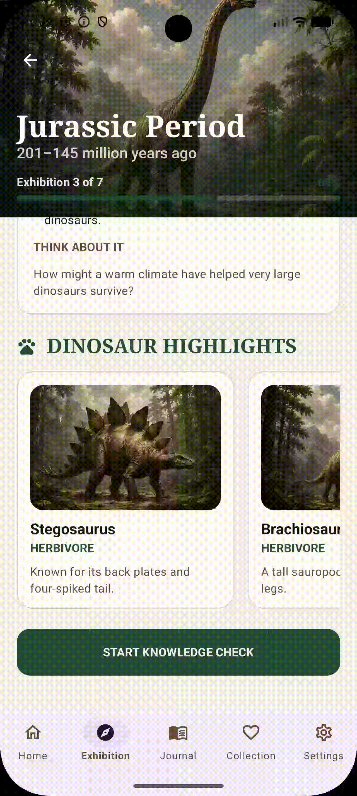
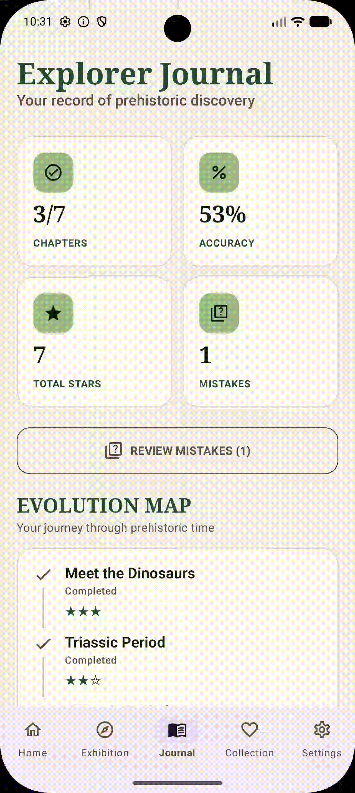
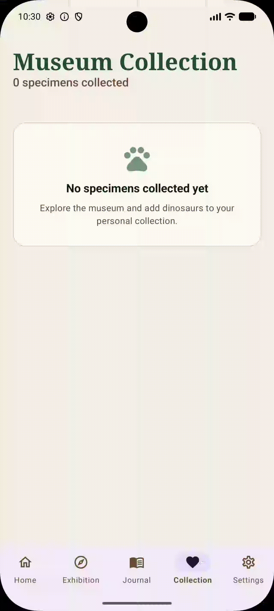
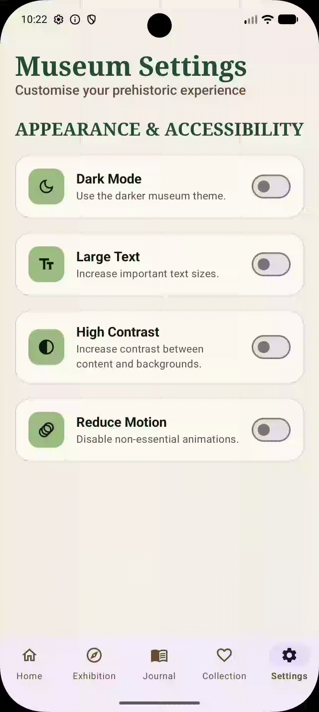
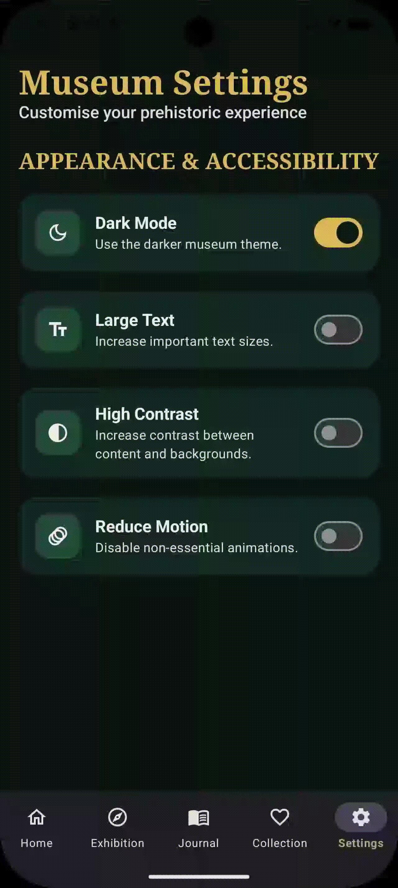
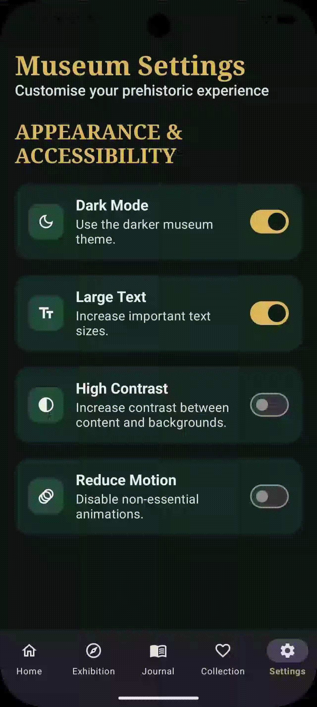
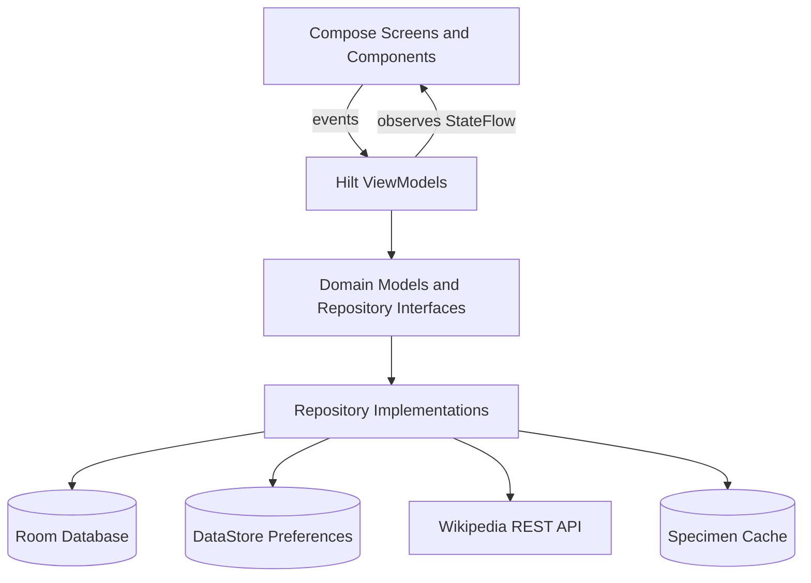

<div align="center">

# 🦖 DinoPath

## Interactive Prehistoric Learning Journey

**Explore · Learn · Discover**

DinoPath is a museum-themed Android educational application that guides learners through prehistoric history using structured exhibitions, dinosaur specimen cards, knowledge checks, persistent progress, mistake review, collections, and accessibility preferences.

<br>


</div>

---

## 0. Application Preview

### 0.1 Subject Information
- Developer: Yutong Ji
- Student ID: 14795504
---

### 0.2 Demonstration GIFs

## 🎬 Application Demo

The following GIF demonstrations present the main DinoPath user flows, including the knowledge check, learning records, museum collection, and accessibility settings.

<table>
<tr>

<td align="center" width="50%">

<br><br>
<strong>Knowledge Check & Review</strong>
<br><br>
Complete the Jurassic knowledge check, receive immediate feedback, view the final result, and review submitted answers.
</td>

<td align="center" width="50%">

<br><br>
<strong>Explorer Journal & Mistake Review</strong>
<br><br>
Track completed chapters, accuracy, stars, mistakes, evolution progress, recent activity, and review incorrect answers.
</td>

</tr>

<tr>

<td align="center" width="50%">

<br><br>
<strong>Museum Collection</strong>
<br><br>
Add dinosaur specimens to the personal museum collection, view saved specimens, and remove favourites.
</td>

<td align="center" width="50%">

<br><br>
<strong>Dark Mode</strong>
<br><br>
Switch between the light museum theme and the darker prehistoric museum experience.
</td>

</tr>

<tr>

<td align="center" width="50%">

<br><br>
<strong>Large Text</strong>
<br><br>
Increase important text sizes while retaining scrollability and readable layouts.
</td>

<td align="center" width="50%">

<br><br>
<strong>High Contrast</strong>
<br><br>
Increase foreground and background contrast to improve content visibility.
</td>

</tr>
</table>

### Demo Features

| Demo | Feature Demonstrated |
|---|---|
| Knowledge Check & Review | Quiz selection, submission, immediate feedback, scoring, result, and answer review |
| Explorer Journal & Mistake Review | Learning statistics, Evolution Map, recent activity, mistakes, and mastery review |
| Museum Collection | Persistent favourites, specimen cards, and removal |
| Dark Mode | Persistent light and dark museum themes |
| Large Text | Accessibility-oriented typography scaling |
| High Contrast | Increased foreground/background contrast for improved readability |

---

## 📁 GIF File Structure

```text
assets/
├── quiz_and_review.gif
├── journal_mistakes_record.gif
├── heart_collection.gif
├── dark_mode.gif
├── large_text.gif
└── high_contrast.gif
```

### 0.3 Quick Start Guide

#### Environment requirements

- Android Studio with Android Gradle Plugin 9.2.1 support
- JDK 17
- Android SDK Platform 37
- Android emulator or physical Android device
- Internet connection for live Wikipedia specimen summaries
- No internet connection is required for the core chapter, quiz, progress, collection, and settings experience

#### Project configuration

| Configuration | Value |
|---|---:|
| Application ID | `com.example.dinopath` |
| Minimum SDK | 24 |
| Target SDK | 37 |
| Compile SDK | 37 |
| Java toolchain | 17 |
| Kotlin | 2.2.10 |
| Version name | 1.0 |
| Version code | 1 |
| Room database version | 3 |

#### Running steps

1. Clone the repository:

```bash
git clone git@github.com:yutong119/3406-Education-DinoPath.git
cd 3406-Education-DinoPath
```

HTTPS alternative:

```bash
git clone https://github.com/yutong119/3406-Education-DinoPath.git
cd 3406-Education-DinoPath
```

2. Open the project in Android Studio.
3. Wait for Gradle sync to complete.
4. Confirm that the Gradle JDK is set to JDK 17.
5. Install Android SDK Platform 37 if requested.
6. Start an emulator or connect an Android device.
7. Select the `app` run configuration.
8. Click **Run ▶**.

#### Command-line build

```bash
./gradlew :app:assembleDebug
```

#### Run unit tests

```bash
./gradlew testDebugUnitTest
```

The debug APK is generated under:

```text
app/build/outputs/apk/debug/
```

---

## 1. Problem Statement

### 1.1 Dinosaur education is often fragmented

Dinosaur learning resources commonly present isolated facts, long articles, or disconnected species profiles. Learners may be able to read individual facts but still struggle to understand how prehistoric periods, environments, species, extinction, and modern birds fit together.

DinoPath addresses this problem by organising the subject as a sequenced museum journey rather than a collection of unrelated pages.

### 1.2 Passive reading provides limited feedback

Static educational material does not always show whether a learner has understood the content. Without questions, explanations, scoring, or review, learners can move through information without identifying misconceptions.

DinoPath includes interactive knowledge checks that provide:

- one-answer-at-a-time selection;
- immediate correct or incorrect feedback;
- a correct answer when the learner is wrong;
- an explanation for every question;
- a final score, accuracy, and star reward;
- a review of submitted answers.

### 1.3 Learners need visible progress

A learner can lose motivation when progress is not recorded or when a completed activity has no lasting effect. DinoPath persists chapter status, best score, accuracy, stars, mistakes, quiz history, and unlocked chapters so that progress remains visible after the application is restarted.

### 1.4 Educational applications should support different users

Text size, contrast, movement, and theme preferences affect usability. DinoPath therefore includes persistent appearance and accessibility controls rather than treating accessibility as an afterthought.

---

## 2. Solution Overview

DinoPath turns prehistoric learning into a museum expedition with the following connected experience:

### 2.1 Museum entrance and visual identity

- Full-screen dinosaur museum entrance
- Clear **Enter the Museum** call to action
- Museum-inspired forest green, fossil cream, and gold visual system
- Serif headings paired with readable sans-serif body text
- Dark and light themes
- Consistent cards, buttons, icons, spacing, and navigation

### 2.2 Structured seven-chapter learning journey

The application models the learning path as seven ordered chapters:

1. Meet the Dinosaurs
2. Triassic Period
3. Jurassic Period
4. Cretaceous Period
5. Dinosaur Habitats and Diets
6. Mass Extinction
7. Dinosaurs and Modern Birds

Each chapter can be represented as:

- `COMPLETED`
- `IN_PROGRESS`
- `LOCKED`

The Home and Journal screens display the same persisted chapter state.

### 2.3 Exhibition-based learning

The Jurassic exhibition contains multiple gallery perspectives:

- climate;
- dinosaurs;
- life beyond dinosaurs.

Each gallery includes a title, explanatory text, key facts, and a reflective prompt. The exhibition also displays illustrated dinosaur highlights and an interactive specimen detail bottom sheet.

### 2.4 Knowledge checks and feedback

The Jurassic Knowledge Check includes three questions. Learners can:

- select one option;
- submit an answer;
- receive immediate feedback;
- read an explanation;
- proceed to the next question;
- view their final score and accuracy;
- review all submitted answers;
- return to the museum lobby.

### 2.5 Persistent learning records

Room stores:

- chapter progress;
- quiz results;
- unmastered mistakes;
- favourite specimens;
- cached Wikipedia specimen summaries.

DataStore stores:

- Dark Mode;
- Large Text;
- High Contrast;
- Reduce Motion.

### 2.6 Resilient online and offline content

The Home screen requests a live Stegosaurus summary from Wikipedia. The repository uses a cache-first / network-refresh strategy and provides local fallback content when the network request fails.

This ensures that a temporary network failure does not make the main educational card unusable.

---

## 3. Key Features

### 3.1 Welcome experience

- Full-screen local museum background image
- Gradient overlay for text legibility
- Museum-themed title and introduction
- Animated entrance button that respects Reduce Motion
- Welcome screen occupies the full window without the bottom navigation bar

### 3.2 Home museum lobby

- Total-star badge
- “Today’s Expedition” hero card
- Jurassic image, estimated duration, and progress indicator
- Continue Expedition button
- Featured Stegosaurus specimen
- Live Wikipedia summary with Room cache
- Offline local image and description fallback
- Retry action when live content is unavailable
- Add to / remove from Collection control
- Seven-chapter Learning Journey timeline

### 3.3 Jurassic exhibition

- Image-based exhibition header
- Jurassic date range
- Exhibition progress indicator
- Three gallery selectors
- Structured educational cards
- Key facts and reflective prompts
- Illustrated dinosaur highlight cards
- Dinosaur detail modal bottom sheet
- Clear return navigation
- Start Knowledge Check action

### 3.4 Dinosaur detail bottom sheet

Selecting a dinosaur card in Exhibition or Collection opens a reusable Material 3 bottom sheet containing:

- local dinosaur illustration;
- specimen name;
- geological period;
- diet;
- description;
- clear close action;
- scrollable content for larger text sizes.

### 3.5 Knowledge Check

- Three Jurassic questions
- Single-answer selection
- Disabled submission until an answer is chosen
- Answer locking after submission
- Correct / incorrect state
- Correct answer disclosure
- Educational explanation
- Question progress indicator
- Score calculation
- Accuracy calculation
- One-to-three-star reward
- Saving, retry, and failure states
- Final review of all submitted answers

### 3.6 Progress persistence and chapter unlocking

When a quiz is completed, DinoPath:

- saves the quiz attempt;
- calculates score, accuracy, and stars;
- preserves the best historical chapter result;
- marks the chapter as completed;
- records incorrect answers as mistakes;
- removes corrected mistakes;
- unlocks the next chapter;
- refreshes Home and Journal through reactive Room flows.

### 3.7 Explorer Journal

The Journal provides a persistent learning dashboard with:

- completed chapter count;
- average quiz accuracy;
- total stars;
- active mistake count;
- Review Mistakes button;
- Evolution Map;
- completed, current, and locked chapter states;
- recent quiz activity;
- score, accuracy, stars, and date for each recent attempt.

### 3.8 Mistake review

- Displays only unmastered mistakes
- Shows the original question
- Shows the learner’s answer
- Shows the correct answer
- Shows the explanation
- Allows the learner to mark a mistake as mastered
- Updates the Journal mistake count reactively
- Includes empty, loading, and error states

### 3.9 Museum Collection

- Persistent favourite specimens
- Local specimen thumbnail
- Name, period, diet, and description
- Specimen detail bottom sheet
- Remove from Collection action
- Removing and error states
- Empty-state guidance
- Home favourite icon stays synchronized with Room

### 3.10 Appearance and accessibility

Settings are persisted through DataStore:

- **Dark Mode** — switches between light and dark museum palettes
- **Large Text** — increases important typography
- **High Contrast** — strengthens foreground/background distinction
- **Reduce Motion** — disables non-essential animation

Additional accessibility considerations include:

- meaningful content descriptions;
- clear Back and Close descriptions;
- heading semantics;
- state communication through icons and text, not colour alone;
- scrollable content under Large Text;
- stable local fallback content;
- responsive Material 3 navigation.

---

## 4. Technical Implementation

### 4.1 Technology stack

| Area | Technology |
|---|---|
| Language | Kotlin |
| UI | Jetpack Compose |
| Design system | Material Design 3 |
| Navigation | Navigation Compose |
| Adaptive navigation | Material 3 Navigation Suite |
| Architecture | MVVM + Repository |
| Dependency injection | Hilt |
| Local database | Room |
| Preferences | DataStore Preferences |
| Networking | Retrofit |
| JSON conversion | Moshi |
| Remote images | Coil |
| Async programming | Kotlin Coroutines |
| Reactive state | Flow / StateFlow |
| Unit testing | JUnit 4 + Coroutines Test |

### 4.2 Architecture



### 4.3 Package structure

```text
com.example.dinopath
├── data
│   ├── local
│   │   ├── dao
│   │   └── entity
│   ├── preferences
│   ├── remote
│   │   └── dto
│   └── repository
├── di
├── domain
│   ├── model
│   ├── repository
│   └── scoring
├── navigation
└── ui
    ├── app
    ├── collection
    ├── components
    ├── home
    ├── journal
    ├── knowledge
    ├── mistakes
    ├── screens
    ├── settings
    └── theme
```

### 4.4 Room database design

The Room database contains five entities:

| Entity | Purpose |
|---|---|
| `ChapterProgressEntity` | Chapter order, status, stars, best score, accuracy, and unlock state |
| `QuizResultEntity` | Historical quiz attempts |
| `MistakeEntity` | Incorrect answers that remain available for review |
| `FavouriteSpecimenEntity` | Persistent museum collection |
| `SpecimenCacheEntity` | Cached Wikipedia specimen summary and image metadata |

Database migrations preserve user data as the schema evolves.

### 4.5 Repository responsibilities

| Repository | Responsibility |
|---|---|
| `LearningProgressRepository` | Chapters, quiz history, quiz completion, mistakes, and unlocking |
| `QuizRepository` | Jurassic question content |
| `CollectionRepository` | Favourite specimen persistence |
| `SpecimenRepository` | Wikipedia fetch, Room cache, stale-cache fallback |
| `UserPreferencesRepository` | Theme and accessibility preferences |

### 4.6 Reactive UI state

ViewModels expose immutable `StateFlow` UI state. Compose screens collect the state lifecycle-aware and recompose when Room or DataStore emits a change.

Examples include:

- Home updates when stars or favourites change;
- Journal updates when a quiz result or mistake changes;
- Collection updates immediately after adding or removing a specimen;
- theme and accessibility settings apply without manual screen refresh.

### 4.7 Navigation strategy

The application uses a single `NavHost`.

Top-level destinations:

- Home
- Exhibition
- Journal
- Collection
- Settings

Secondary destinations:

- Welcome
- Knowledge Check / Result
- Mistake Review

The adaptive navigation suite is displayed only on top-level destinations. Welcome and secondary learning flows use the full screen without an empty navigation container.

---

## 5. Reliability, Testing, and Quality

### 5.1 Existing unit tests

The project contains focused unit tests for:

- `KnowledgeCheckViewModel`
- `HomeViewModel`
- `CollectionViewModel`
- `CachedSpecimenRepository`

The tests cover important behaviours such as:

- initial quiz state;
- correct and incorrect scoring;
- answer progression;
- quiz completion;
- persistent result success and failure;
- duplicate save prevention;
- Home loading and repository state;
- collection add/remove state;
- cache and fallback behaviour.

### 5.2 Manual regression flow

The final application should be verified through this end-to-end flow:

```text
Welcome
→ Enter Museum
→ Home
→ Exhibition
→ Open Dinosaur Details
→ Knowledge Check
→ Result
→ Back to Lobby
→ Journal
→ Review Mistakes
→ Collection
→ Settings
```

### 5.3 Resilient states

DinoPath explicitly supports:

- loading states;
- empty states;
- network errors;
- database/save errors;
- retry actions;
- cached content;
- local content fallback;
- disabled actions;
- processing states;
- duplicate-action prevention.

### 5.4 Git development practice

Development follows a minimal-module commit approach:

- one feature or visual module per commit;
- clear prefixes such as `feat:`, `fix:`, `style:`, `test:`, and `docs:`;
- build and test verification before committing;
- no unrelated refactoring inside feature commits.

---

## 6. Expected Educational Impact

DinoPath aims to help learners:

- understand prehistoric history as a connected timeline;
- engage with educational material through a museum narrative;
- test understanding immediately after learning;
- learn from incorrect answers instead of only receiving a score;
- maintain motivation through stars and visible progression;
- revisit previous attempts through recent activity;
- build mastery by resolving mistakes;
- use the application in a preferred visual and motion configuration;
- continue learning when live network content is unavailable.

The application is designed not only to display dinosaur information, but to create a complete learning loop:

```text
Explore content
→ answer questions
→ receive explanation
→ earn progress
→ review mistakes
→ continue the journey
```

---

## 7. Current Scope and Limitations

DinoPath is a completed educational prototype for the CP3406 assignment. Its current scope includes a fully interactive Jurassic learning and assessment flow alongside the seven-chapter progression model.

Current limitations include:

- the complete interactive content set is concentrated on the Jurassic exhibition;
- Wikipedia availability depends on the network and public endpoint behaviour;
- cached specimen content is currently focused on the featured specimen experience;
- there is no account or cloud synchronization;
- there is no audio or background music;
- local dinosaur illustrations are bundled with the application;
- the app is designed primarily for a single learner on one device.

These limitations do not prevent the core offline learning, quiz, progress, Journal, Collection, and Settings flows from operating.

---

## 8. Future Development

Potential future extensions include:

- complete exhibition content and quizzes for all seven chapters;
- multiple specimen detail pages per chapter;
- collection search and diet/period filters;
- more varied question types;
- achievement badges;
- spaced-repetition scheduling for mistakes;
- teacher or parent progress summaries;
- optional multilingual content;
- expanded offline encyclopaedia content;
- additional UI and navigation instrumentation tests;
- cloud backup and cross-device synchronization.

Future work should preserve the current privacy-friendly local-first architecture and accessibility controls.

---

## 9. Asset and Content Acknowledgements

### 9.1 Local visual assets

DinoPath includes local dinosaur and museum illustrations under:

```text
app/src/main/res/drawable-nodpi/
```

Before final submission, record the exact source, author, licence, and access date for each externally sourced asset:

| Asset | Source / author | Licence | Access date |
|---|---|---|---|
| `welcome_dino_bg.webp` | **Add exact source** | **Add licence** | **Add date** |
| `stegosaurus.webp` | **Add exact source** | **Add licence** | **Add date** |
| `brachiosaurus.webp` | **Add exact source** | **Add licence** | **Add date** |
| `allosaurus.webp` | **Add exact source** | **Add licence** | **Add date** |
| `parasaurolophus.webp` | **Add exact source** | **Add licence** | **Add date** |
| `triceratops.webp` | **Add exact source** | **Add licence** | **Add date** |
| `velociraptor.webp` | **Add exact source** | **Add licence** | **Add date** |

Do not claim that an asset is copyright-free unless the original licence explicitly supports that statement.

### 9.2 External information service

- Wikipedia REST page-summary service supplies optional live specimen information.
- Live data is cached locally for resilience.
- DinoPath is not affiliated with or endorsed by Wikipedia or the Wikimedia Foundation.

### 9.3 Development resources

- Android Developers documentation
- Kotlin documentation
- Jetpack Compose documentation
- Material Design 3 guidance
- Room, DataStore, Hilt, Retrofit, Moshi, Coil, and Coroutines documentation
- James Cook University Singapore CP3406 learning materials

---

## 10. Project Information

| Item | Details |
|---|---|
| Course | CP3406 — Mobile Computing |
| Institution | James Cook University Singapore |
| Project | Assignment 3 — Education App |
| Application | DinoPath |
| Developer | Yutong Ji |
| Student ID | 14795504 |
| Lecturer | Dr. KumMeng Lum |
| GitHub | `https://github.com/yutong119/3406-Education-DinoPath` |
| Version | 1.0 |
| Project status | Completed — August 2026 |
| Licence | Educational use for JCU CP3406 assignment submission |

---

## 11. Additional Documentation

The repository can include the following supporting documents:

- architecture diagram;
- development roadmap;
- task and commit plan;
- testing evidence;
- AI-generated material declaration;
- image and content asset register;
- final demonstration screenshots;
- final demonstration video or GIFs.

Recommended documentation structure:

```text
docs/
├── architecture/
├── ai-declaration/
├── assets/
├── testing/
└── screenshots/
```

---

## 12. Project Philosophy

> “Learning becomes a journey when every discovery leads to the next question.”

DinoPath combines museum-inspired visual design, structured learning, persistent progress, reflection, and accessibility to make prehistoric education feel exploratory rather than passive.
